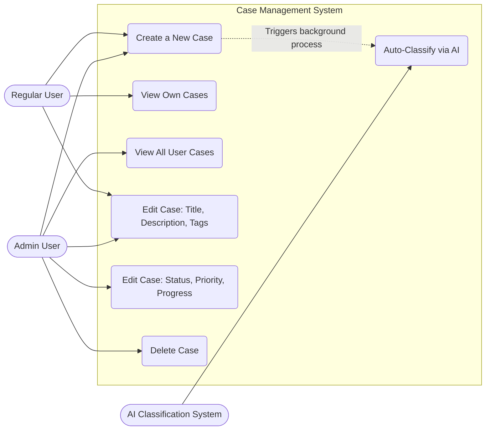
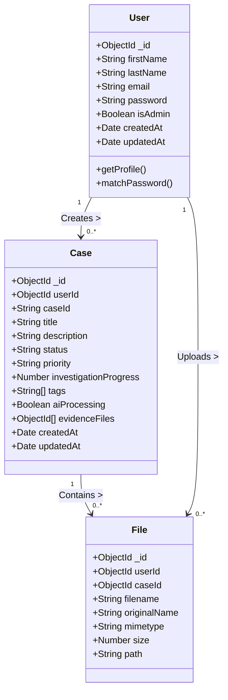

# CyberGuard Case Management System Diagrams

This document contains requested system architecture, use case, class, and sequence diagrams modeled using [Mermaid.js](https://mermaid.js.org/). Most Markdown previewers (including GitHub) natively render these diagrams.

## 1. System Architecture Diagram
Illustrates the high-level architecture of the Client-Server model, external services, and data storage.

```mermaid
graph TD
    subgraph Client [Frontend (React + Vite)]
        UI[User Interface]
        AuthCtx[Auth Context]
        Router[React Router]
        State[State Management]
    end

    subgraph Server [Backend (Node.js + Express)]
        API[Express API Gateway]
        Middleware[JWT Auth Middleware]
        Controllers[Controllers: Auth, Case, File]
        AIService[AI Classifier Service]
    end

    subgraph Database [Storage]
        DB[(MongoDB Cluster)]
    end

    subgraph External [External Services]
        NGROK((AI Endpoint via ngrok))
    end

    UI -->|HTTP Requests| API
    API --> Middleware
    Middleware --> Controllers
    Controllers --> DB
    
    %% AI Integration Flow
    Controllers -.->|Triggers Asynchronously| AIService
    AIService -->|POST /classify| NGROK
    NGROK -->|Returns Categories & Severity| AIService
    AIService -->|Updates Tags & Priority| DB
```

---

## 2. Use Case Diagram
Details the interactions between different actors (Regular User, Admin User, and the AI System) and operations within the Case Management System.



---

## 3. Class (Data Structure) Diagram
Details the MongoDB schema models and relationships between Users, Cases, and uploaded Evidence Files.



---

## 4. Sequence Diagram (Case Creation & AI Classification Flow)
Shows the precise sequence of operations when a case is created and how the background AI classification is achieved while maintaining a responsive UI.

```mermaid
sequenceDiagram
    actor U as User
    participant F as Frontend (React UI)
    participant B as Backend (Express API)
    participant DB as MongoDB
    participant AI as AI Service (ngrok endpoint)

    U->>F: Fills out case details & submits
    F->>B: POST /api/cases (title, description, tags)
    B->>DB: Case.create({ aiProcessing: true })
    DB-->>B: Returns Case object
    
    %% Fire and forget background process
    B-)B: classifyAndUpdate(caseId, description)
    
    B-->>F: 201 Created (Instant Response)
    F-->>U: Shows "Case created" & Spinning AI Indicator
    
    %% Background Task Process
    rect rgb(30, 41, 59)
        Note over B, AI: Asynchronous Background Process
        B->>AI: POST /classify { text: description }
        AI-->>B: Returns { categories, severity }
        B->>DB: Case.findByIdAndUpdate(tags, priority, aiProcessing: false)
    end
    
    %% Frontend Polling Loop
    loop Every 3 seconds (Auto-Poll)
        F->>B: GET /api/cases
        B->>DB: Fetch latest cases
        DB-->>B: Return cases
        B-->>F: Response
        alt aiProcessing == false
            F-->>U: Removes Spinner, Unlocks Tags & Priority
        end
    end
```


